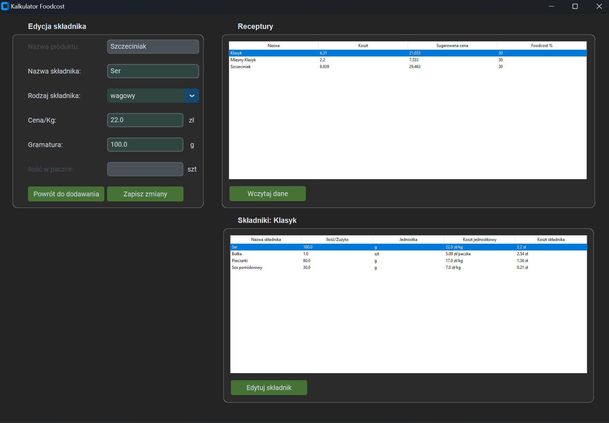

#  Food Cost App

A desktop application for calculating recipe costs, suggested selling prices, and Food Cost percentage.

This project was created to solve a real problem in my own business. I wanted to build a dedicated application for managing recipe costs instead of calculating everything manually. I decided to build a tool that helps me manage recipe costs while improving my Python skills.

The application is actively developed, and new features are added as I continue learning.

---

# Why I built this project

I run my own food business and wanted a simple application that would help me calculate recipe costs quickly and accurately.

Rather than creating another tutorial project, I chose to build something that I could actually use every day. This project allows me to combine programming with a real business need.

My long-term goal is to turn this into a complete restaurant cost management application.

---

# Current Features

- ✅ Add recipes
- ✅ Add weight-based ingredients
- ✅ Add piece-based ingredients
- ✅ Automatic ingredient cost calculation
- ✅ Calculate total recipe cost
- ✅ Calculate suggested selling price
- ✅ Calculate Food Cost percentage
- ✅ Save data to JSON
- ✅ Load saved recipes
- ✅ Display recipes in a table
- ✅ Display ingredients for the selected recipe
- ✅ Edit ingredients
- ✅ Delete ingredients and recipes

---
# Planned Features

This project is still under active development.

### Recipe Management

- [ ] Duplicate recipes

### Database

- [ ] Replace JSON with SQLite
- [ ] Price history
- [ ] Ingredient search

### Business Tools

- [ ] Margin calculation
- [ ] Selling price analysis
- [ ] Profit calculation
- [ ] Reports and statistics

### Export

- [ ] CSV export
- [ ] Excel export
- [ ] PDF export
 
### User Experience

- [ ] Improved interface
- [ ] Custom dialog windows
- [ ] Better styling
- [ ] Dark/Light theme support

# Technologies

- Python
- CustomTkinter
- Tkinter Treeview
- JSON
- Object-Oriented Programming (OOP)
- Git, Github

---

# Project Structure

```text
Food Cost App
│
├── appGUI.py          # User interface
├── Data.py            # Data storage and calculations
├── Product.py         # Ingredient model
├── main.py            # Application entry point
├── product_data.json  # Stored recipes
```

---

# Installation

Clone the repository:

```bash
git clone https://github.com/szymkaw1/foodcost-app.git
```

Go to the project folder:

```bash
cd foodcost-app
```

Install CustomTkinter:

```bash
pip install customtkinter
```

Run the application:

```bash
python main.py
```

---

# Screenshots


---

# What I learned

While building this project I have been learning and practicing:

- Object-Oriented Programming
- Working with JSON files
- Building desktop applications using CustomTkinter
- Event handling
- Organizing larger Python projects
- Separating GUI from application logic
- Refactoring code to reduce duplication
- Input validation

---

# About this project

This is not a finished product.

The goal is to continuously improve both the application and my programming skills. Instead of creating many small tutorial projects, I prefer building one larger application that gradually becomes more professional over time.

---

# Author

**Szymon Kawalerski**

If you have any suggestions or feedback, feel free to open an Issue or contact me.