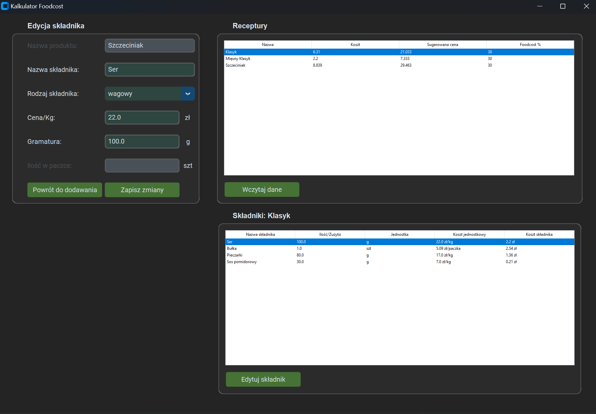
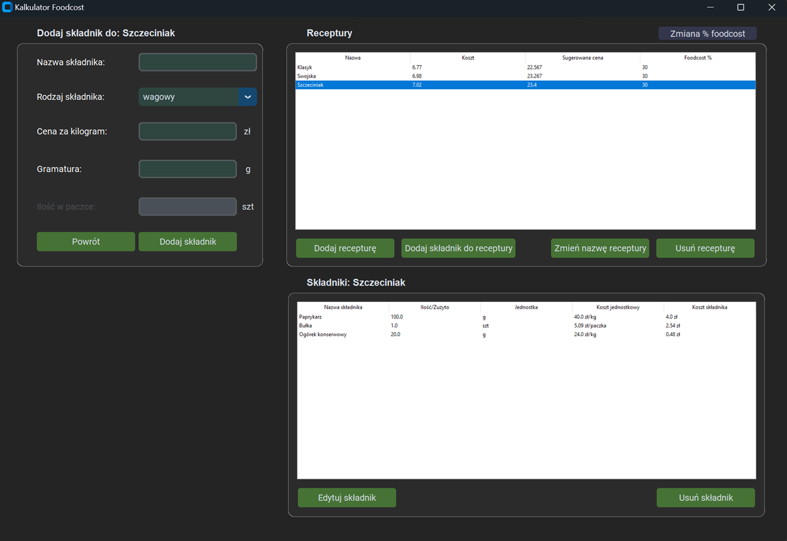

#  Food Cost App

A desktop application for calculating recipe costs and suggested selling prices.

I created this project to solve a real problem in my own food business. Instead of calculating recipe costs manually, I decided to build my own application. It also helps me improve my Python skills.

Version 1.0 is the first completed desktop version of this project.

---


# Why I built this project

I wanted to create something more useful than another tutorial project.

This application helps me calculate recipe costs faster and more accurately. At the same time, I can practice Python by building a real application.

In the future I want to turn this project into a web application.

---
# Version 1.0 - Desktop
Version 1.0 is the first completed desktop version of this project.

It includes all basic features for managing recipes, calculating recipe costs and suggested selling prices.

The next step is to rebuild this application as a web application and continue adding new features.

# Current Features

- Add recipes
- Add ingredients
- Edit ingredients
- Delete recipes and ingredients
- Calculate recipe cost
- Calculate suggested selling price
- Change Food Cost percentage
- Input validation
- Prevent duplicate names
- Save and load data using JSON
- Automatic table refresh
- Confirmation before deleting data
- Rename recipes
---
# Planned Features

### v2.0 (planned)

- Web version
- SQLite database
- Ingredient library
- Copy ingredients between recipes
- User accounts
- Reports and export (PDF / CSV / Excel)
- Search and filter recipes and ingredients
- Price history

---

# Technologies

- Python
- CustomTkinter
- Tkinter Treeview
- JSON
- Object-Oriented Programming (OOP)
- Git, Github

---

# What I Learned

While building this project I learned:

- Object-Oriented Programming
- Working with JSON
- Building desktop applications
- Input validation
- Refactoring code
- Using Git and GitHub
- Organizing larger Python projects

---

# Installation

Clone the repository:

```bash
git clone https://github.com/szymkaw1/foodcost-app.git
```

Go to the project folder:

```bash
cd foodcost-app
```

Install CustomTkinter:

```bash
pip install customtkinter
```

Run the application:

```bash
python main.py
```

---

# Screenshots
### Alpha Version
- Basic recipe management
- Initial GUI
- JSON storage



---

### v1.0 
- Recipe and ingredient management
- Full validation
- Delete confirmation
- Dynamic ingredient panel
- Food Cost %
- Selection restore
- Improved UX



---

# About this project
This is the first completed version of my application.

I will continue developing it while learning new technologies. My next goal is to create a web version.

---
